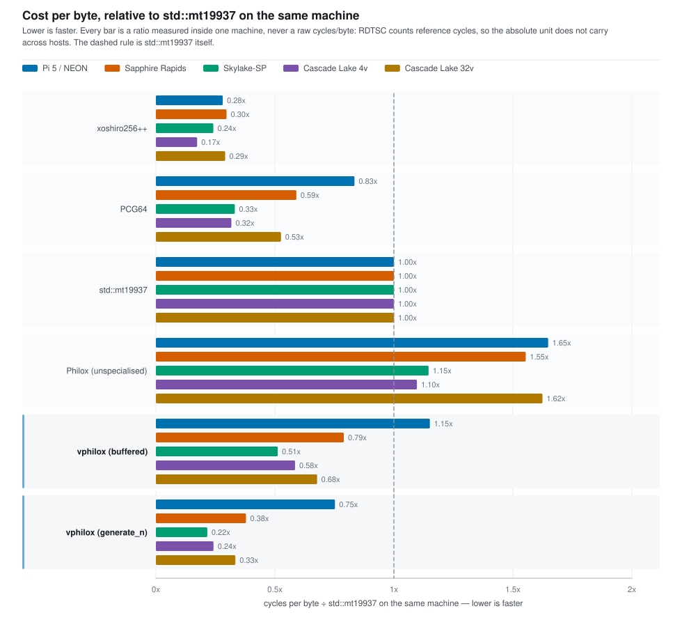
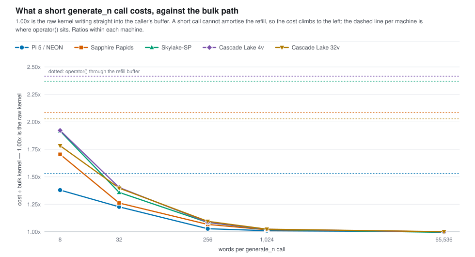
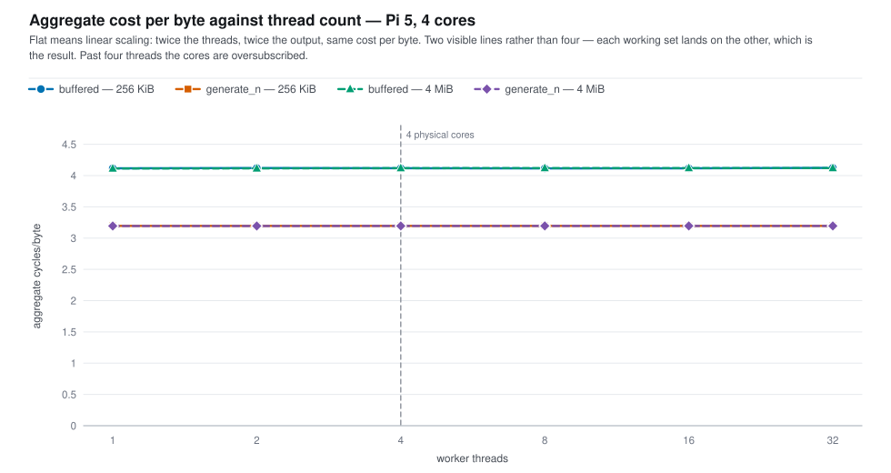
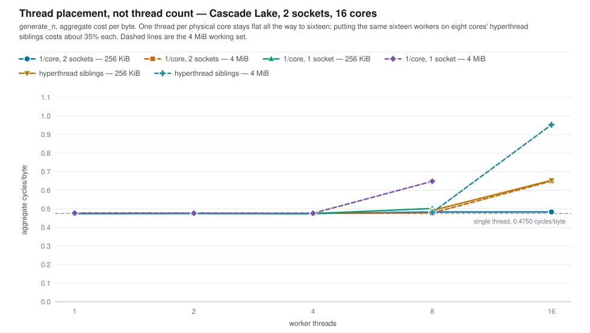

<h1 id="sec:intro"><span class="secno">1</span> Introduction</h1>

Consider a Monte Carlo simulation that runs for a week on a
cluster, writes a checkpoint every hour, and is restarted after a node failure
onto whatever hardware the scheduler has free. For the restart to be
scientifically meaningful, the random number generator must resume at exactly
the position where it stopped. The replacement node need not resemble the one
that died: it may run a different C++ standard library, carry a different
instruction set, and be handed a different number of worker threads. A
generator fit for this setting has to be indifferent to all three. In C++ the
standard mechanism for resuming a generator is the stream insertion and
extraction operators on the engine, and for `std::mt19937` that mechanism
does not survive even the first of them.

Two independent defects combine. The first concerns the numeric base. The
standard specifies that the insertion operator sets the decimal flag on the
stream, and libstdc++ implements this by overriding a caller’s `std::hex`;
the Microsoft standard library does not, so a caller who has set hexadecimal
formatting obtains hexadecimal digits there and decimal digits under libstdc++.
Each library then reads the other library’s digits in the wrong base. The
second concerns the layout. libstdc++ writes the 624 state words in raw
internal order followed by a position index; libc++ and the Microsoft standard
library write the same 624 words rotated into canonical order and write no
position at all. The word counts agree, which is what makes the failure
dangerous: a reader that accepts 624 integers has no way to detect that it has
been handed a differently ordered array, so the restore succeeds and the
simulation continues from a state that is not the one that was saved.

Neither defect is hypothetical. A model trained and serialized on Linux under
XGBoost 3.3.0 was reported as failing to deserialize on Windows under the same
library version, with the base mismatch surfacing as a hard
error \[[8](#ref-xgboostbug)\]; the report rules out a version mismatch, a damaged
file, and a locale difference in turn. That failure is the recoverable case.
The layout defect is the one that does not announce itself.

The failure is a consequence of serializing an implementation instead of a
position. A Mersenne Twister state is a large array plus an index into it, and
the array has no canonical form. A counter-based generator has no such array.
Following Salmon et al. \[[1](#ref-salmon2011)\], the $n$th output block of Philox is
a stateless bijection applied to the integer $n$ under a key, so the complete
state of a stream is the key and the value of $n$. Writing that down is
unambiguous, and reading it back cannot silently land somewhere else.

The same structure answers the remaining two axes without additional
machinery. Because the bijection is fixed, any implementation that computes it
correctly emits the same words, so a checkpoint written on a node running the
AVX-512 kernel resumes on a node running the NEON one: how a host vectorizes
the round function is an implementation detail the stream cannot observe. And
because two disjoint counter ranges are two independent substreams, a
work-partitioned program consumes the same random numbers in the same positions
regardless of how many threads it runs on or in what order the scheduler
happens to run them. Seeking comes free with it, since advancing a stream by
$N$ blocks is an addition on a 128-bit integer, so `discard` runs in
$\mathcal{O}\!\left(1\right)$, not in time proportional to $N$.

These properties are not new; they are the reason counter-based generators were
proposed. What has kept them out of some CPU codebases is a performance
objection. A proposal to make the serialized generator state of XGBoost, a
widely used gradient boosting library, portable across platforms by replacing
`std::mt19937` with a Philox engine was declined on throughput grounds:
“\[t\]he performance here is 1/10 of mt. This is due to no specialisation for
wide multiplies” \[[9](#ref-xgboostrng)\].[^2] That objection is the thing this work has to remove, and it sets the
shape of the evaluation: the target is not to be the fastest generator
available, but to make the portability properties cost nothing.

This paper makes four contributions.

1.  A generator whose output is invariant across the three axes above:
    thread count, thread scheduling, and the instruction set of the host
    (Section [7.1](#sec:reproducible)). A partitioned run on four threads and the
    same run on sixty-four consume identical numbers in identical
    positions, and a stream generated by the AVX-512 kernel is bit-identical
    to one generated by the scalar reference. A generator with shared state
    offers this only by locking, or not at all.

2.  A parallel characterisation of what that costs
    (Section [7](#sec:parallel)). Aggregate cost per byte is flat with thread
    count to one thread per physical core, and the first limit reached on a
    16-core host is hyperthread co-location at 35% per worker, not memory
    bandwidth. The mechanism is execution-port contention:
    instruction supply is excluded by direct measurement, since co-location
    costs 59% more per byte while L1 instruction-cache misses per
    thousand instructions *fall* by 36%.

3.  A portable serialized state (Section [3](#sec:state)) that records a position
    and no engine internals, refuses malformed input instead of
    interpreting it, and does not consult the locale. A change to the
    engine’s internal buffer size, from 8 blocks to 16, left previously
    written states readable, which is the property being claimed.

4.  Counter-interleaved SIMD kernels for AVX2, AVX-512 and ARM NEON
    (Section [4](#sec:simd)), and a measurement of the objection that motivated
    them (Section [6](#sec:single)). On five processors, unspecialised scalar
    Philox costs between $1.10\times$ and $1.65\times$ per byte what
    `std::mt19937` costs, not $10\times$; with the multiplies
    specialised the bulk path costs between $0.22\times$ and $0.75\times$.

We also report two results that go against the library, in
Section [9](#sec:limitations): xoshiro256++ is faster on four of the five machines
measured, and on ARM the buffered engine interface remains slower than
`std::mt19937` even though the NEON kernel beneath it is faster.

<h1 id="sec:background"><span class="secno">2</span> Background</h1>

<h2 id="counter-based-generation"><span class="secno">2.1</span> Counter-based generation</h2>

A conventional generator holds internal state $s$ and computes
$(s_{i+1}, x_i) = f(s_i)$, so obtaining $x_n$ requires $n$ applications of $f$.
A counter-based generator instead defines


<div class="equation">
<span class="eq-anchor" id="eq:cbrng"></span>
<span class="eqno">(1)</span>

$$

  x_n = b(\mathbf{c}_0 + n, \mathbf{k}),
$$

</div>

where $b$ is a keyed bijection, $\mathbf{c}_0$ is a starting counter and $\mathbf{k}$ is a
key. Nothing carries between successive outputs. The three properties used
throughout this paper follow directly from Equation [(1)](#eq:cbrng): the state is
$(\mathbf{k}, n)$ and nothing else, evaluating $x_n$ for arbitrary $n$ costs the same
as evaluating $x_0$, and disjoint ranges of $n$ are independent.

<h2 id="philox4x32-10"><span class="secno">2.2</span> Philox4x32-10</h2>

Philox4x32 takes a 128-bit counter, held as four 32-bit words
$\mathbf{c}= (c_0, c_1, c_2, c_3)$, and a 64-bit key $\mathbf{k}= (k_0, k_1)$. One round
performs two $32 \times 32 \to 64$ multiplications, splits each product into
its high and low halves, and permutes the words:


<div class="equation">
<span class="eq-anchor" id="eq:mul0"></span>
<span class="eq-anchor" id="eq:mul1"></span>
<span class="eq-anchor" id="eq:round"></span>
<span class="eqno">(2) (3) (4)</span>

$$
\begin{aligned}
  (h_0, l_0) &= \mathrm{mulhilo}(M_0,\, c_0),\\
  (h_1, l_1) &= \mathrm{mulhilo}(M_1,\, c_2),\\
  \mathbf{c}' &= \bigl(h_1 \oplus c_1 \oplus k_0,\; l_1,\;
                 h_0 \oplus c_3 \oplus k_1,\; l_0\bigr),
\end{aligned}
$$

</div>

with $M_0 = \mathtt{0xD2511F53}$ and $M_1 = \mathtt{0xCD9E8D57}$. Between
rounds the key advances by a Weyl sequence,
$k_0 \mathrel{+}= \mathtt{0x9E3779B9}$ and
$k_1 \mathrel{+}= \mathtt{0xBB67AE85}$, which breaks the symmetry that would
otherwise make every round identical. Ten rounds are applied; seven already
pass BigCrush \[[1](#ref-salmon2011)\], so the standard variant carries a margin.

The whole construction is integer multiply, exclusive or, addition and word
permutation. It contains no floating-point instruction, a fact that becomes
relevant in Section [6.4](#sec:avx512).

<h2 id="the-one-invariant"><span class="secno">2.3</span> The one invariant</h2>

Every design decision below is subordinate to a single rule: for a given key
and counter, vphilox produces exactly the bytes that the Random123 reference
implementation produces, across compilers, architectures and library versions.
This is enforced in two ways. The published test vectors of
Salmon et al. \[[1](#ref-salmon2011)\] are checked directly, and an 8191-block stream
is folded into an FNV-1a digest compared against a constant fixed in the test
source. The digest run covers what the published vectors cannot: SIMD tail
handling, the refill buffer, chunked bulk calls, the counter carry chain and
floating-point conversion. A change that moves the digest is a different
generator, not a new version of this one.

<h1 id="sec:state"><span class="secno">3</span> Portable serialized state</h1>

<h2 id="what-is-written"><span class="secno">3.1</span> What is written</h2>

The serialized form records a position, defined as the key, the counter of the
block containing the next output, and the index of the word within that block:

``` text
vphilox1 <k0> <k1> <c0> <c1> <c2> <c3> <word>
```

Seven decimal integers and a version tag. Every field is an unsigned 32-bit
value except the final word index, which lies in $[0, 4)$.

The distinction between this and the engine’s internal variables is the point
of the design. The engine generates into a buffer of `refill_blocks`
blocks at a time and hands out words from it, so its internal counter runs
ahead of the caller-visible position by however much remains buffered.
Serializing the internal counter and buffer cursor would embed
`refill_blocks` in the file format. That constant changed from 8 to 16
when the AVX-512 kernel landed, because a refill must not be split across a
kernel invocation. States written before the change remain readable after it,
which is the property a checkpoint format has to have and the one
`std::mt19937` lacks.

Recovering the caller-visible position requires the inverse of the counter
advance, since the internal counter must be retreated by the number of blocks
still buffered. This is the reason the 128-bit counter arithmetic in the
library implements subtraction as well as addition.

<h2 id="two-rules-the-writer-follows"><span class="secno">3.2</span> Two rules the writer follows</h2>

**The locale is never consulted.** Integer extraction through
`std::istream` routes through the `num_get` facet of the global
locale, which may be imbued with digit grouping. The library formats and parses
digits by hand; the only stream operations performed are on characters. A
program that has imbued a grouping locale for its user interface therefore
cannot corrupt its own checkpoints.

**Unrecognised input is refused, not interpreted.** Parsing fails on a
wrong version tag, a wrong field count, a value exceeding $2^{32}-1$, a word
index outside a block, or trailing characters. The contrast with the
`std::mt19937` case is exact: there, a valid-looking array of 624 integers
in the wrong order is accepted, and the generator resumes at a position nobody
chose. Here, a state that cannot be read produces an error the caller can
observe.

<h2 id="constant-time-seek"><span class="secno">3.3</span> Constant-time seek</h2>

Because block $n$ is $b(\mathbf{c}_0 + n, \mathbf{k})$, advancing the stream by $N$ blocks
is the addition $\mathbf{c}\mathrel{+}= N$ on a 128-bit little-endian integer. The
implementation propagates carries across four 32-bit words, so
`discard(N)` costs the same for $N = 1$ and for $N = 2^{40}$. The
corresponding operation on a Mersenne Twister requires either $N$ state
transitions or a jump polynomial computed offline.

*Remark 1*. The engine exposes both `counter()` and `state()`, and they are not
interchangeable. Constructing an engine from `key()` and `counter()`
skips whatever the buffer still holds, because `counter()` is the counter
of the *next refill*. Only `state()` and `set_state()` form an
exact round trip, and a test asserts that the other route skips, so the
difference is recorded as behaviour and not left as a trap.

<h1 id="sec:simd"><span class="secno">4</span> Vectorization by counter interleaving</h1>

<h2 id="the-kernel-contract"><span class="secno">4.1</span> The kernel contract</h2>

Every backend implements one function, and Algorithm [1](#alg:contract) states its
obligation.

<figure id="alg:contract" class="algorithm">

<div class="alg-body">

**Input:** base counter $\mathbf{c}_0$, key $\mathbf{k}$, output pointer `out`, block count $B$

**Output:** $4B$ unsigned 32-bit words written to `out`

1. **for** $i \leftarrow 0$ **to** $B - 1$ **do**
2. &nbsp;&nbsp;&nbsp;&nbsp;write $\mathrm{philox4x32}_{10}(\mathbf{c}_0 + i,\, \mathbf{k})$ to `out`$[4i \ldots 4i+3]$
3. **end for**
4. **return**

</div>

<figcaption>
<span class="label">Algorithm 1.</span> Kernel contract, shared by all four backends.
</figcaption>

</figure>

Two requirements attach to it. Output must not depend on how the caller divides
a request, so generating $B$ blocks in one call and in several calls of
summed length $B$ must produce identical bytes. And the kernel handles its own
tail, since `out` carries no alignment or length guarantee. The first
requirement is what makes cross-backend parity testing meaningful, and it is
what allows the engine to choose any refill size.

Each backend also advertises `preferred_blocks`, the block count at which
it runs without a tail. Table [1](#tab:widths) lists the four.

<figure id="tab:widths" class="table-figure">

| Backend | `preferred_blocks` | Layout |
|:---|---:|:---|
| scalar | 1 | reference implementation, fully `constexpr` |
| AVX2 | 8 | 8 counters per `__m256i` |
| AVX-512 | 16 | 16 counters per `__m512i` |
| NEON | 8 | 4 counters per `uint32x4_t`, 2 groups interleaved |

<figcaption>

<span class="label">Table 1.</span> Interleaving width per backend. On x86 the width is one counter per
32-bit lane. NEON carries four lanes per register but two independent groups
per iteration, for the reason given in Section [4.3](#sec:neon).
</figcaption>

</figure>

<h2 id="why-the-multiplies-are-the-difficulty"><span class="secno">4.2</span> Why the multiplies are the difficulty</h2>

Equations [(2)](#eq:mul0) and [(3)](#eq:mul1) require the full 64-bit product of two 32-bit values.
Scalar code obtains this from a single widening multiply instruction. Vector
instruction sets do not offer a 32-lane widening multiply that keeps both
halves in place; on x86, `vpmuludq` multiplies the even 32-bit lanes of
its operands and writes 64-bit results. Producing $W$ independent 64-bit
products from $2W$ packed 32-bit values therefore takes two multiplies, one on
the even lanes and one on the odd lanes after a shift, followed by a repack.

The consequence is that a naive vectorization at four counters per 256-bit
register leaves half the lanes idle during the exclusive-or, key broadcast and
permutation steps of Equation [(4)](#eq:round), while still paying for the lane
management. Filling all eight 32-bit lanes and paying the extra even/odd
multiply amortises that management across twice as many counters. A direct
comparison of the two layouts on an Intel Core i5-11300H measured the
eight-counter layout 21.1% faster, and it is the layout used. The AVX-512
kernel applies the same reasoning at 16 counters per register.

<h2 id="sec:neon"><span class="secno">4.3</span> NEON is latency-bound, not width-bound</h2>

The first NEON kernel used one group of four counters per iteration and reached
2.2035 cycles per byte on a Cortex-A76, which is $1.46\times$ the scalar kernel
but only $0.89\times$ `std::mt19937`. Width was not the constraint. The
ten rounds of Philox form a serial dependency chain, and one four-lane group
issues its multiplies faster than their latency retires them, so the pipeline
drains between rounds.

Carrying two independent groups per iteration and alternating their rounds
fills that latency with the other group’s work. The result is 1.4652 cycles per
byte, a speedup of $1.504\times$ over the single-group kernel, which places
vphilox ahead of both `std::mt19937` ($1.33\times$) and PCG64
($1.11\times$) on that machine. This is why `preferred_blocks` for NEON
is 8 and not 4: the advertised width reflects the work per iteration, not
the register width.

<h2 id="dispatch"><span class="secno">4.4</span> Dispatch</h2>

A backend is selected only if it was compiled in, is marked implemented, and is
supported by the running processor. Feature detection uses a direct
`CPUID` and `XGETBV` probe written once per compiler, not a
compiler builtin, so the Linux and macOS builds exercise the same detection
path that the Microsoft build depends on. Resolution happens once per round
count on first use.

Instruction set flags are never applied to the whole build. Kernels carry
per-function target attributes, so one binary starts and runs correctly on a
processor lacking the instructions and falls back at run time. This matters for
the distribution model: a header-only library that required an
`-mavx512f` build would push the portability problem from the checkpoint
file to the binary.

<h2 id="sec:float"><span class="secno">4.5</span> Floating-point conversion</h2>

The obvious conversion from a random word to a value in $[0,1)$ divides by
$2^{32}$, which costs a conversion instruction and a division. The library
instead constructs the result bit pattern directly. For single precision,
setting the sign bit to zero and the exponent field to 127 and placing 23
random bits in the mantissa yields a value uniform on $[1, 2)$; subtracting one
maps it to $[0, 1)$:


<div class="equation">
<span class="eq-anchor" id="eq:tofloat"></span>
<span class="eqno">(5)</span>

$$

  \mathrm{to\_float01}(u) =
    \mathrm{bitcast}\bigl(\mathtt{0x3F800000} \mathbin{|} (u \gg 9)\bigr) - 1.0f.
$$

</div>

The double precision form is identical with exponent 1023 and 52 mantissa bits.
On the vector path this is a bitwise or followed by a subtract.

The cost is resolution, not correctness. The injection fills the 23
stored mantissa bits, so outputs are uniform on a grid of spacing $2^{-23}$ and
9 of the 32 random bits are discarded. A float carries 24 significand bits, but
the 24th is the implicit leading one, which the fixed exponent pins and which
therefore carries no entropy. Callers who need all 32 bits should take the
integers.

How much a vector form of Equation [(5)](#eq:tofloat) is worth depends on where the
conversion loop is bound. Measured against working set on Sapphire Rapids, an
AVX-512 conversion loop is $1.89\times$ the scalar one at the 256-word tile the
library converts in and $3.19\times$ at 32 MiB, converging with it at 512 KiB
where the loop is bandwidth-bound and width buys nothing. The width therefore pays at the tile size the library actually converts in,
which is the case for putting the conversion on the vector path.

Both steps of Equation [(5)](#eq:tofloat) are exact. The subtraction is exact by
Sterbenz’s lemma, since the operands lie within a factor of two of each other,
and adding the value back is exact because $k \cdot 2^{-23}$ needs only 23
significant bits. Every injected bit therefore survives a round trip, and this
is verified exhaustively over all $2^{23}$ representable outputs, not by
sampling.

<h1 id="sec:method"><span class="secno">5</span> Experimental method</h1>

<h2 id="what-is-measured-and-in-what-unit"><span class="secno">5.1</span> What is measured, and in what unit</h2>

Results are reported first in cycles per byte and second in bytes per second.
Cycles are read from the timestamp counter on x86 and through
`perf_event_open` on Linux ARM. The unit choice removes the clock from
the comparison between generators on one machine, which is what most of the
questions here are about.

It does not remove the clock from comparisons *between* machines. The x86
timestamp counter increments at a fixed reference frequency, not the
core frequency, and the ARM counter is a different counter entirely. Cycles per
byte is therefore compared only within a single host. Any figure spanning
several machines plots a ratio formed inside each machine, which is
dimensionless and does transfer. Absolute values appear only in tables that
carry the machine name beside them.

<h2 id="the-measurement-protocol"><span class="secno">5.2</span> The measurement protocol</h2>

Runs are driven by a script and never by hand, for reasons each learned by
getting the measurement wrong first.

The build is unconditional. A stale build directory will run a months-old
binary and print a plausible table, and nothing in the output identifies it as
stale. The script also asserts that the expected benchmark rows exist before
accepting a run.

The frequency governor is pinned for the run and restored on exit, and the
resolved backend, compiler, processor model, commit hash and verbatim command
are recorded next to the numbers. The backend in particular cannot be recovered
after the fact: three early archived runs were taken on AVX-512 hardware while
the AVX-512 kernel was still a stub, so the processor model does not determine
what executed. Every benchmark binary now stamps the resolved backend into its
JSON output.

A run is rejected if the cycle counter did not report or if any row exceeds a
coefficient of variation of 1% in cycles per byte. Every archived run also
carries a quality label, and four runs in the archive do not meet the bar; they
are excluded from every figure and are kept because they built the harness.
Cloud instances are treated as suitable for correctness and for throughput only
when the instance has dedicated virtual CPUs and the run still clears the
variation bar, in which case the write-up says so.

*Remark 2* (Virtual machines cannot place threads). A guest publishes a correct-looking sibling map and accepts every affinity
mask, while the hypervisor schedules virtual CPUs onto host cores on its own.
The mask then fixes virtual identifiers and nothing physical. Under WSL2 we
measured two workers on one core’s siblings as *faster* than two on
separate cores (0.63 against 0.63 to 0.77 cycles per byte, and stable against a
20% spread), which is impossible for an execution-port-bound kernel under real
co-location. The placement study in Section [7.3](#sec:placement) therefore runs on bare
metal and gates itself on a measured co-location penalty before it will report
anything.

<h2 id="machines"><span class="secno">5.3</span> Machines</h2>

Table [2](#tab:machines) lists the six hosts. The two Cascade Lake entries are the
same processor, family 6 model 85 stepping 7, in a four-vCPU slice of a shared
socket and on a whole two-socket host. They are reported as separate machines
because cycles per byte does not transfer between hosts and these two behave as
two hosts.

Five hosts carry the throughput results in Section [6](#sec:single). The sixth, a Tiger
Lake laptop, carries only the two studies that need physical thread placement
instead of absolute throughput, for the reason stated in the remark above: it
is the one multi-core host on record that is both bare metal and
simultaneously exposes a working performance monitoring unit. Its own throughput
matrix is archived as harness validation and is quoted nowhere, because a
four-core machine running a full desktop cannot hold the variation bar across a
whole sweep.

<figure id="tab:machines" class="table-figure">

| Label | Processor | MHz | Backend | Used for |
|:---|:---|---:|:---|:---|
| Pi 5 / NEON | Raspberry Pi 5, 4-core Cortex-A76, bare metal | 2400 | `neon` | throughput, scaling |
| Sapphire Rapids | Intel Xeon Platinum 8481C, dedicated vCPU | 2700 | `avx512` | throughput |
| Skylake-SP | Intel Xeon, dedicated vCPU | 2000 | `avx512` | throughput |
| Cascade Lake 4v | Intel Xeon, 4 dedicated vCPU | 2800 | `avx512` | throughput |
| Cascade Lake 32v | Intel Xeon, whole 2-socket host, 16 cores | 2800 | `avx512` | throughput, placement |
| Tiger Lake | Intel Core i5-11300H, 4 cores $\times$ 2 threads, bare metal, no turbo | 3100 | `avx512` | placement mechanism |

<figcaption>

<span class="label">Table 2.</span> Measurement hosts. Two are bare metal; the remaining four are cloud
instances with dedicated virtual CPUs.
</figcaption>

</figure>

Turbo is disabled on the Tiger Lake host so that reference cycles and core
cycles coincide: the timestamp counter ticks at that part’s base clock, so with
boost off cycles per byte is a true core-cycle count and a moving turbo ceiling
cannot land in the column. The cost is that its absolute numbers are
approximately $1.4\times$ the same machine’s boosted numbers and are comparable
only within that host, which is all either study asks of them.

<h2 id="reproducibility-of-the-figures"><span class="secno">5.4</span> Reproducibility of the figures</h2>

Every table and figure in this paper is generated from archived JSON by one
script that uses only the Python standard library. Continuous integration runs
the script in checking mode, so a run archived without regenerating the derived
files fails the build. The script writes its own scalable vector graphics and
its own PDF as fixed-precision text, which makes both byte-reproducible and
therefore checkable; the raster versions are the one output excluded from the
check, because no two renderers agree byte for byte.

<h1 id="sec:single"><span class="secno">6</span> Single-threaded throughput</h1>

<h2 id="the-comparison-matrix"><span class="secno">6.1</span> The comparison matrix</h2>

Figure [1](#fig:matrix) and Table [3](#tab:matrix) give cost per byte for each generator
divided by `std::mt19937` on the same machine. Lower is faster.

<figure id="fig:matrix">


<figcaption>

<span class="label">Figure 1.</span> Cost per byte relative to `std::mt19937`, measured within each
machine. Five hosts, seven generators.
</figcaption>

</figure>

<figure id="tab:matrix" class="table-figure">

|                       |          |          |          |          |          |
|:----------------------|---------:|---------:|---------:|---------:|---------:|
|                       |     Pi 5 | Sapphire | Skylake- |  Cascade |  Cascade |
|                       |     NEON |   Rapids |       SP |  Lake 4v | Lake 32v |
| xoshiro256++          |     0.28 |     0.30 |     0.24 |     0.17 |     0.29 |
| PCG64                 |     0.83 |     0.59 |     0.33 |     0.32 |     0.53 |
| `std::mt19937`        |     1.00 |     1.00 |     1.00 |     1.00 |     1.00 |
| Philox, unspecialised |     1.65 |     1.55 |     1.15 |     1.10 |     1.62 |
| vphilox, `operator()` |     1.15 |     0.79 |     0.51 |     0.58 |     0.68 |
| vphilox, `generate_n` | **0.75** | **0.38** | **0.22** | **0.24** | **0.33** |

<figcaption>

<span class="label">Table 3.</span> Cost per byte relative to `std::mt19937` on the same machine.
Bold marks the lowest cost achieved by vphilox in each column.
</figcaption>

</figure>

<h2 id="the-wide-multiply-objection"><span class="secno">6.2</span> The wide-multiply objection</h2>

The row that answers the objection in Section [1](#sec:intro) is the fourth. Scalar
Philox without specialised wide multiplies costs between $1.10\times$ and
$1.65\times$ per byte what `std::mt19937` costs. The reported figure was
$10\times$. It did not reproduce on any of the five machines, and on the
four-vCPU Cascade Lake it is within 10% of parity.

We do not claim the original measurement was wrong, only that it does not
describe the comparison as made here. A plausible explanation is that the
measurement went through a heavier abstraction layer than the generator itself,
which is a property of the integration and not of Philox.

With the multiplies specialised, the bulk path costs between $0.22\times$ and
$0.75\times$. The objection is removed twice over: once by measuring the
unspecialised case honestly, and once by specialising it.

<h2 id="the-refill-buffer-is-the-remaining-cost"><span class="secno">6.3</span> The refill buffer is the remaining cost</h2>

The gap between the two vphilox rows in Table [3](#tab:matrix) is the refill buffer.
The engine satisfies `std::uniform_random_bit_generator`, which requires
a per-call interface, so it generates into an aligned 64-word buffer and hands
out words. The bulk entry points run the kernel straight into the caller’s
buffer and skip the copy.

That gap widens as the kernel gets
faster: $1.53\times$ on the Pi, $2.03\times$ on Cascade Lake 32v, $2.09\times$
on Sapphire Rapids, $2.37\times$ on Skylake-SP and $2.42\times$ on Cascade Lake
4v. A second pass over every byte has a fixed cost per byte, so the faster the
kernel becomes, the larger the fraction of total time that drain represents.
Expressed the other way, the buffer costs approximately 109% of bulk
throughput on AVX-512, 42% on AVX2 and 10% on x86 scalar.

Figure [2](#fig:sweep) shows the practical form of this. A bulk call of eight words
costs $1.4\times$ to $1.9\times$ the raw kernel; by 256 words the remainder is
a few percent, and by 65536 words it has gone. The two fastest kernels pay the
most for a call too small to amortise the setup, which is the same effect seen
from the other direction.

<figure id="fig:sweep">


<figcaption>

<span class="label">Figure 2.</span> Cost of a bulk call relative to the raw kernel on the same machine,
against call size in words. The dashed line per machine is the per-call
interface through the refill buffer.
</figcaption>

</figure>

<h2 id="sec:avx512"><span class="secno">6.4</span> AVX-512 and the frequency licence</h2>

Intel processors reduce core frequency when executing 512-bit instructions, and
on Skylake-SP that reduction was large enough to make AVX-512 a net loss for
some workloads. The concern applies directly here, since dispatch prefers the
widest available kernel.

It does not appear. Table [4](#tab:avx512) gives bulk cost per byte with the backend
pinned, same binary in each row.

<figure id="tab:avx512" class="table-figure">

| Machine          | scalar |   AVX2 |    AVX-512 |      vs AVX2 | width conv. |
|:-----------------|-------:|-------:|-----------:|-------------:|------------:|
| Skylake-SP       | 2.1753 | 0.7698 | **0.4202** | $1.83\times$ |         92% |
| Sapphire Rapids  | 1.9311 | 0.8462 | **0.4712** | $1.80\times$ |         90% |
| Cascade Lake 32v | 2.2883 | 0.8740 | **0.4747** | $1.84\times$ |         92% |
| Cascade Lake 4v  | 2.4142 | 0.8537 | **0.5466** | $1.56\times$ |         78% |

<figcaption>

<span class="label">Table 4.</span> Bulk kernel cost per byte by pinned backend, cycles per byte, same
binary in every row. Width conversion is the AVX-512 speedup as a fraction of
the doubled lane width, so 100% would be perfect scaling with
register width.
</figcaption>

</figure>

The reason is structural, not a matter of tuning. Intel’s frequency
licences are tiered by the kind of 512-bit instruction executing, not by width
alone: heavy floating-point and fused multiply-add work drops the core to the
lowest licence, while light integer, logical and shuffle work stays at or near
the AVX2 licence. As noted in Section [2](#sec:background), the Philox inner loop is
`vpmuludq`, `vpaddd`, `vpxord`, `vpsrlq` and lane shuffles,
with no floating-point instruction anywhere in it. Counter-based generators
built on integer multiplication are therefore unusually good candidates for
512-bit vectorization, because they never enter the licence tier that makes it
a bad trade.

One row of Table [4](#tab:avx512) looks at first like the penalty and is not. A
four-vCPU slice of a Cascade Lake socket converts 78% of the doubled width,
against 90% to 92% everywhere else, but that is a property of the instance
and not of the part: the same stepping on a whole two-socket host converts
92%, and on the shared slice the *scalar* kernel is slower as well, at
2.4142 against 2.2883 cycles per byte for code containing no 512-bit
instruction at all. No frequency licence can produce a scalar slowdown. The
consistent explanation is that other tenants move the package turbo budget
underneath a measurement the timestamp counter reports in reference cycles,
which is the risk described in Section [5](#sec:method).

That reading is not confirmed, and the 4-vCPU figure is reported, not
discarded. What the hosts jointly support is narrower and sufficient: AVX-512
beats AVX2 on every part measured, by $1.56\times$ at worst and $1.84\times$ at
best, so the dispatch preference stands, and on a part whose cores are not
shared a probe recording core frequency alongside the benchmark shows it flat
across the range in question.

<h1 id="sec:parallel"><span class="secno">7</span> Parallel behaviour</h1>

<h2 id="sec:reproducible"><span class="secno">7.1</span> Output does not depend on the configuration</h2>

The property that motivates the parallel work is not throughput, so it is
stated before any timing. Because worker $j$ of $P$ takes a fixed counter range
determined by the partition and not by the order in which threads happen to
run, the concatenated output of a partitioned run is identical for every $P$ and
every scheduling. Two runs of the same simulation, one on four threads and one
on sixty-four, consume the same random numbers in the same positions. A
generator with shared state offers this only by serialising access behind a
lock, or by accepting a different stream for each configuration.

The same holds across the hardware. The kernel contract of Section [4](#sec:simd)
requires every backend to emit what the scalar reference emits, independent of
how a request is chunked, so the four backends are interchangeable at the level
of the stream. A run that begins on a node dispatching to AVX-512 and resumes
from a checkpoint on a node dispatching to NEON continues the same sequence.
Two tests carry it, covering different halves. The first folds an 8191-block
stream, a length chosen to straddle every backend’s interleaving width, into a
digest checked against a constant compiled into the test. The second pins a
serialized state string produced on x86 and requires that restoring it and
drawing 4096 words reproduces a fixed digest, which is the checkpoint half: the
machine reading the state is not the machine that wrote it. Continuous
integration runs both on Linux, Windows and macOS arm64, so an x86-written state
is restored on an ARM host on every commit.

Together with the serialized state of Section [3](#sec:state), this is what lets a
checkpoint move between unlike nodes. The remainder of this section measures
what the property costs.

<h2 id="cost-per-byte-does-not-move-with-thread-count"><span class="secno">7.2</span> Cost per byte does not move with thread count</h2>

Counter-based generation partitions with no shared state, so aggregate cost per
byte should be independent of the number of workers. On the Raspberry Pi 5,
across 1 to 32 threads and two working set sizes, bulk cost per byte spans
0.063%, from 3.1934 to 3.1954 cycles per byte. Four threads on four cores give
$3.95\times$ the throughput of one, an efficiency of 98.8%. Beyond four
threads throughput plateaus while cost per byte still does not move, which is
what exhausting the cores looks like, not a limit in the generator.
Figure [3](#fig:scaling) draws both working sets across the range.

<figure id="fig:scaling">


<figcaption>

<span class="label">Figure 3.</span> Aggregate cost per byte against thread count on the Raspberry Pi 5.
Four series are drawn and two are visible, because each working set lands on
the other.
</figcaption>

</figure>

Four cores are too few to reach a knee, which is why the placement study
exists.

<h2 id="sec:placement"><span class="secno">7.3</span> The first limit is hyperthread co-location</h2>

On a two-socket, sixteen-core Cascade Lake host the curve does bend, and
Figure [4](#fig:placement) separates the cause from the correlate. With one worker
per physical core, aggregate cost per byte is flat from 1 to 16 cores, moving
from 0.4750 to 0.4833 cycles per byte, a rise of 1.7%. Placing two workers on
one core’s hyperthread siblings costs 0.6536 cycles per byte, approximately
35% per worker.

<figure id="fig:placement">


<figcaption>

<span class="label">Figure 4.</span> Aggregate cost per byte against thread placement, Cascade Lake, two
sockets, sixteen physical cores. Dashed lines are the 4 MiB working
set.
</figcaption>

</figure>

The mechanism is that the kernel is execution-port-bound. Two hardware threads
sharing one core’s multiply ports do not have two cores’ worth of issue
capacity, and Philox spends its time in exactly the ports they contend for.
Memory enters as a second and later limit, and it tracks footprint per socket
against the 33 MiB last-level cache instead of tracking thread count. Frequency
is flat across the whole range.

<h2 id="sec:icache"><span class="secno">7.4</span> Instruction supply is not part of the penalty</h2>

Sibling threads share one first-level instruction cache as well as the
execution ports, which makes instruction supply a competing explanation for the
same penalty. Table [5](#tab:icache) separates them. Four workers run the identical
job twice, changing only placement, with retired-instruction and level-one
instruction-cache read-miss counters attached to each worker.

<figure id="tab:icache" class="table-figure">

| Placement             | Cyc./byte |  i\$ MPKI |    Instr./byte |
|:----------------------|----------:|----------:|---------------:|
| One per physical core |    0.5160 |    0.2108 |       0.958554 |
| Packed onto siblings  |    0.8204 |    0.1356 |       0.958554 |
| Change                | $+59.0\%$ | $-35.7\%$ | $\pm 0.000000$ |

<figcaption>

<span class="label">Table 5.</span> Four workers under two placements, Tiger Lake, turbo disabled.
Instruction supply improves where the penalty appears.
</figcaption>

</figure>

Co-location costs 59% more cycles per byte while instruction-cache misses per
thousand instructions *fall* by 36%. Instruction supply moves in the
opposite direction to the penalty, which excludes it as the mechanism and leaves
port contention standing. The direction is not an anomaly: both siblings execute
the same kernel over disjoint counter ranges, so sharing one instruction cache
between two threads running the same loop is constructive, and the second thread
finds the code already resident. A workload whose threads ran different code
would not get that for free.

The third column is the check that the counters were attached to the correct
threads. Instructions per byte is a property of the kernel and cannot move with
placement, and it reads identically to six decimal places in both arms at zero
variation across fifteen repetitions. This matters because the obvious
instrumentation is wrong here: a benchmark framework that starts and stops
counters on the thread running the benchmark loop would have counted the
dispatcher, which blocks on a condition variable while the workers execute every
instruction. Misses per thousand instructions is also a per-instruction ratio
and therefore clock-independent, and it agrees to about 1% between the
turbo-enabled and turbo-disabled runs, across a 42% change in clock.

Two further guards matter because the measurement fails silently without them. The study refuses to run on a host where two workers on one core’s
siblings do not cost at least 15% more than two workers on separate cores,
since the absence of that penalty means the affinity mask never moved anything;
this host cleared the gate at 35.6% to 40.6% across three invocations, and
that figure agrees with the 35% measured on the unrelated Cascade Lake part.
The co-located arm’s variation, 2.22%, exceeds this paper’s 1% bar and is
reported, not hidden. Its median reproduces to 0.04% across two
independent runs, and the finding is a direction and not a threshold, so a
2% error bar does not reach a 36% effect.

<h2 id="sec:runtime"><span class="secno">7.5</span> The scaling result is the generator, not the harness</h2>

Every number above is measured through one persistent worker pool built on
`std::thread`, and a benchmark cannot distinguish a property of the
generator from a property of its own scaffolding. Running the identical job
under a second, independent threading runtime does distinguish them.
Table [6](#tab:runtimes) repeats the sweep under OpenMP, with persistent teams on
both sides so that neither column carries thread creation cost, and normalises
each runtime to its own single-worker result.

<figure id="tab:runtimes" class="table-figure">

| Workers | `std::thread` | $\times$ | OpenMP | $\times$ |
|--------:|--------------:|---------:|-------:|---------:|
|       1 |        0.5084 |    1.000 | 0.5086 |    1.000 |
|       2 |        0.5165 |    1.016 | 0.5086 |    1.000 |
|       4 |        0.6205 |    1.220 | 0.5102 |    1.003 |
|       8 |        0.8076 |    1.588 | 0.9126 |    1.794 |

<figcaption>

<span class="label">Table 6.</span> Aggregate cost per byte by threading runtime, Tiger Lake, 256 KiB per
worker. The $\times$ columns are normalised within each
runtime.
</figcaption>

</figure>

The two runtimes are indistinguishable while cores are free: 0.5084 against
0.5086 at one worker, with both coefficients of variation at or below 0.14%.
At one worker per physical core OpenMP is flat to 0.3%, which reproduces the
sixteen-core result of Section [7.3](#sec:placement) on a completely different part and
a different runtime. At eight workers both runtimes show the hyperthread knee,
so the knee belongs to the hardware rather than to either implementation.

The one row where they disagree is four workers, and the deviation belongs to
the pool rather than to the generator. On the OpenMP path the team master is
itself a worker, so four workers are four runnable threads on four cores. On the
pool path the dispatcher is a separate thread that must be woken once per
iteration to collect results, so four workers are five threads on four cores.
That costs nothing until the workers have claimed every core, which is why the
pool measures flat on the sixteen-core host and flat here at one and two
workers. This explanation is an inference consistent with the data rather than a
separate measurement, and the direct test would need a three-worker row that the
benchmark does not register.

A second-order result falls out of the same sweep, and it is recorded because a
caller can act on it. OpenMP spins before sleeping at the end of a parallel
region.
Forcing it to sleep instead costs 9.0% at one worker per physical core, where
the spin is free, and saves 4.0% at two workers per core, where every spin
steals issue capacity from a sibling that is still working. Callers who run one
worker per physical core should leave the default alone; callers who
oversubscribe to every hardware thread should measure a passive wait policy.

The practical guidance that follows is short: size a Philox thread pool by
physical cores, not by the value `std::thread::hardware_concurrency`
returns.

<h1 id="sec:stat"><span class="secno">8</span> Statistical validation</h1>

Philox4x32-10 is a published and analysed construction, so the question here is
whether this implementation reproduces it, not whether the algorithm is sound.
Both were checked.

**PractRand to 1 TB.** A raw 32-bit stream at seed 0 through the AVX2
backend was tested to $2^{40}$ bytes, reporting no anomalies in 304 results
over 4173 seconds. Across the whole run exactly one test was flagged, at the
4 GB checkpoint, at PractRand’s mildest severity. It did not recur at 8, 16, 32,
64, 128, 256 or 512 GB, nor at 1 TB. That non-recurrence is the substantive
evidence rather than the count: PractRand’s checkpoints are not independent
draws, since each re-runs the same tests over the accumulated stream, so real
structure in the stream strengthens with more data and keeps flagging. A single flag at 4 GB
that is absent at 256 times the data is a fluctuation.

**Backend equivalence.** The backends do not produce similar streams, they
produce identical ones, and this is a design invariant rather than an
observation. A direct byte comparison over the same $2^{40}$ bytes the battery
consumed confirms it for the scalar and AVX2 kernels. The comparison is a byte
comparison rather than a digest comparison, so it requires no collision
argument, with digests recorded alongside for third-party spot checks. For
AVX-512 and NEON the same conclusion rests one layer down, on a parity matrix
that sweeps carrying counters, edge keys and every block count straddling a
plausible SIMD width, plus the cross-platform digest test described in
Section [2](#sec:background). A kernel that reproduces the scalar stream bit for bit
cannot fail a battery the scalar stream passes.

**TestU01 BigCrush.** All 160 statistics pass, in 2 hours 31 minutes of
processor time. The battery is driven through the engine rather than through a
byte stream, so the refill buffer and run-time dispatch are under test as well
as the kernel.

**The float32 stream is deliberately not tested this way.** Running the
converted float bits through a bit-level battery measures the IEEE-754 format,
not the generator. The subtraction in Equation [(5)](#eq:tofloat) renormalises, so the
sign bit is always clear, the exponent field is geometrically skewed with half
of all outputs sharing one exponent, and low mantissa bits are frequently zero
because renormalising a small result shifts zeros in from the right. vphilox
duly fails 114 tests, with the lowest bit of each word reporting
$p = 2 \times 10^{-1994}$, exactly as the mechanism predicts. Every correct
float generator fails this test; the bits of a uniform float are not uniform
bits. That log is archived rather than discarded, so the next person to attempt
it finds the explanation.

What the conversion does have to guarantee is tested directly: an exhaustive
round trip over all $2^{23}$ representable outputs, a chi-squared test over 1024
bins bounded five standard deviations in *both* directions, and a
Kolmogorov-Smirnov test against the uniform distribution. The two-sided bound on
the chi-squared statistic is deliberate, because a value far below the degrees
of freedom indicates counts tracking expectation more closely than chance
allows, which is what a silently coarsened grid looks like. Mutation testing
confirms the tests are not redundant: a stuck low mantissa bit passes
chi-squared and Kolmogorov-Smirnov and is caught only by the exact round trip,
since halving the grid resolution leaves values uniform at any coarser scale.

<h2 id="sec:curand"><span class="secno">8.1</span> Agreement with an independent implementation</h2>

Everything above establishes that vphilox agrees with itself across four kernels
and two architectures, and that the core function reproduces the published test
vectors. Neither addresses the layer at which Philox implementations actually
diverge. The round function is fixed by the specification; the mapping from a
user-facing seed onto a counter and a key is not, and it is where two conforming
implementations produce different streams from the same arguments.

We therefore cross-check against NVIDIA’s cuRAND \[[7](#ref-curand)\], which seeds with
a triple of seed, subsequence and offset where vphilox seeds with a key and a
counter. Sixteen cases were compared over 4096 words each, under all three x86
backends, and every case is identical. The cases were chosen to exercise the
seeding arithmetic rather than the round function: offsets that are not block
aligned, subsequence and offset values straddling $2^{32}$ so that a carry
crosses the counter’s low words, the maximum subsequence, and edge keys
including all zeros and all ones.

Each case asserts two independent things. The first feeds vphilox the counter
and key that cuRAND reports for itself after seeding, testing the round function
and the increment order while assuming nothing about the mapping; it would pass
even if the mapping were entirely wrong. The second requires that the state
cuRAND derived match what the documented mapping predicts from the seed triple,
and that is the interoperability claim: the half that could plausibly have
failed.

The mapping it confirms is that cuRAND’s subsequence occupies the counter’s high
64 bits, that its offset divided by four occupies the low 64 bits, and that the
remainder of that division is a word index into the resulting block. The
asymmetry to watch is that a cuRAND offset counts words where a vphilox counter
counts blocks of four. A practical consequence follows: cuRAND reserves
the entire high half of the counter for stream selection, placing its
subsequences $2^{66}$ values apart, so a program that partitions across GPU
threads the cuRAND way and across CPU threads the vphilox way obtains identical
non-overlapping streams provided both use the same convention.

The comparison needs neither a GPU nor a device compiler: cuRAND guards its
function decoration behind a macro, so defining it compiles NVIDIA’s reference
implementation as host code, and the only target-dependent line computes the
high half of a 32-by-32-bit product identically on both paths. What is verified
is therefore NVIDIA’s reference implementation rather than its device code
generation.

<h1 id="sec:limitations"><span class="secno">9</span> Limitations and results that go against the design</h1>

**xoshiro256++ is faster on four of five machines.** It leads on the Pi, on
Sapphire Rapids and on both Cascade Lake hosts. On Skylake-SP the vphilox bulk
path costs 0.4210 cycles per byte against 0.4703, so vphilox wins one part on
one machine. That is a result rather than a trend. We report it and do not
optimise toward it: xoshiro256++ is a latency-bound scalar chain that a wider
kernel does not catch, and it offers none of the properties in
Section [1](#sec:intro). Speed here has to be good enough that the objection cannot be
raised again, and no more than that.

**The buffered engine is still behind `std::mt19937` on ARM.** The
NEON kernel leads it at $1.33\times$, but the per-call interface costs
$1.15\times$ `std::mt19937` per byte because the refill drain now costs
more than the kernel does. Callers who use the bulk path get the full benefit
on that platform; callers who use `operator()` do not.

**Vector floating-point conversion is not yet implemented.** The
conversion in Section [4.5](#sec:float) is scalar. The intended form operates on a whole
kernel output block so values never leave vector registers, and until that
lands, a caller requesting floats pays a per-value cost that the integer path
does not.

**The instruction-supply result rests on one four-core host.** The
measurement in Section [7.4](#sec:icache) needs simultaneous access to symmetric
multithreading, a working performance monitoring unit and real control over
thread placement, and exactly one machine on record provides all three. Its
co-located arm exceeds the variation bar, as Section [7.4](#sec:icache) states. The
elimination of instruction supply is a direction reproduced across four runs and
two clock regimes rather than a threshold, and it would be stronger on a host
with more cores; the same is true of the runtime contrast in
Section [7.5](#sec:runtime), whose four-worker row is the row that matters and is
measured where four workers exhaust the machine.

**The cuRAND comparison is against host-compiled reference code.** As
Section [8.1](#sec:curand) states, what is verified is NVIDIA’s reference implementation
rather than code generated for a device. The residual gap is one line computing
the high half of a 32-bit product.

**Cloud measurement.** Four of the six hosts are cloud instances with
dedicated virtual CPUs. Steal time is invisible on such a host, and the
mitigation applied is the variation bar plus the quality label rather than
elimination of the risk. One of the two bare-metal hosts, the Raspberry Pi 5, is
also the machine on which the flattest and most reproducible scaling curve was
measured, which is consistent with the concern being real. The other bare-metal
host is the four-core laptop just discussed, so the archive has no machine that
is simultaneously bare metal and large.

<h1 id="sec:related"><span class="secno">10</span> Related work</h1>

Salmon et al. \[[1](#ref-salmon2011)\] introduced the Philox and Threefry families and
the argument that a counter-based generator makes parallel random number
generation a matter of partitioning integers. The reference implementation,
Random123, is the source of the test vectors used here. This work differs in
what it targets: portable serialized state as the deliverable, with
vectorization as the means of making that state free rather than as the result.

The Mersenne Twister \[[2](#ref-matsumoto1998)\] remains the default engine in the C++
standard library, and its state is the object of the portability failure in
Section [1](#sec:intro). PCG \[[3](#ref-oneill2014)\] and
xoshiro/xoroshiro \[[4](#ref-blackman2021)\] are modern stateful generators with small
states and strong statistical results; both appear in the comparison matrix, and
both are faster than vphilox on most parts measured. Neither offers a
standard-library-independent serialized state, constant-time seek or thread-count
independence, which is the trade this paper is about.

TestU01 \[[5](#ref-lecuyer2007)\] and PractRand \[[6](#ref-practrand)\] supply the
statistical batteries in Section [8](#sec:stat). Vectorized generator implementations
are available in vendor libraries, including Intel’s Vector Statistics Library
and NVIDIA’s cuRAND \[[7](#ref-curand)\], both of which include Philox variants; the
distinction here is the header-only, dependency-free distribution model and the
run-time dispatch that lets one binary select its kernel on the host it lands
on.

<h1 id="sec:conclusion"><span class="secno">11</span> Conclusion</h1>

Checkpointing a `std::mt19937` and restoring it on a different standard
library is not reliable, and the failure mode on macOS is silent. Storing a
position instead of an implementation removes the failure by construction, and
the position of a counter-based stream is a key and an integer.

What has kept that substitution off CPUs is a performance objection, and the
measurements here answer it in two parts. Its stated magnitude, a tenfold
penalty against `std::mt19937`, did not reproduce on any of five
processors; the measured range is $1.10\times$ to $1.65\times$. Interleaving
counters across SIMD lanes then brings the bulk path to between $0.22\times$ and
$0.75\times$, and avoids the AVX-512 frequency licence trap by construction,
since Philox contains no floating-point instruction. In parallel, cost per byte
does not move with thread count, and the first limit on a sixteen-core host is
hyperthread co-location. Both competing explanations for that limit are excluded
by measurement: instruction supply improves under co-location even as the
penalty appears, and a second threading runtime reproduces the flat result to
within 0.3%.

Two directions follow. The refill buffer is now the dominant remaining cost on
the fastest kernels, at roughly 109% of bulk throughput on AVX-512, so removing
the second pass over every byte is worth more than further widening the kernel.
And the floating-point conversion should be moved onto the vector path, so that
a caller asking for floats keeps the throughput a caller asking for integers
already has.

<h1 id="availability">Availability</h1>

vphilox is released under MIT or Apache-2.0 at
[https://github.com/sinhaparth5/vphilox](https://github.com/sinhaparth5/vphilox). Every benchmark in this paper is
reproducible from the archived JSON and the scripts in that repository, and the
derived tables and figures are regenerated by a single command that continuous
integration verifies. The release measured here is archived at
[doi:10.5281/zenodo.22103483](https://doi.org/10.5281/zenodo.22103483),
and `CITATION.cff` in the repository carries the same identifier.

<ol class="references">

<li id="ref-salmon2011">

J. K. Salmon, M. A. Moraes, R. O. Dror, and D. E. Shaw,
“Parallel random numbers: As easy as 1, 2, 3,”
in *Proceedings of the International Conference for High Performance
Computing, Networking, Storage and Analysis (SC’11)*,
Seattle, WA, USA, 2011, pp. 16:1–16:12.
</li>

<li id="ref-matsumoto1998">

M. Matsumoto and T. Nishimura,
“Mersenne twister: A 623-dimensionally equidistributed uniform pseudo-random
number generator,”
*ACM Transactions on Modeling and Computer Simulation*,
vol. 8, no. 1, pp. 3–30, 1998.
</li>

<li id="ref-oneill2014">

M. E. O’Neill,
“PCG: A family of simple fast space-efficient statistically good algorithms
for random number generation,”
Tech. Rep. HMC-CS-2014-0905, Harvey Mudd College, Claremont, CA, USA, 2014.
</li>

<li id="ref-blackman2021">

D. Blackman and S. Vigna,
“Scrambled linear pseudorandom number generators,”
*ACM Transactions on Mathematical Software*,
vol. 47, no. 4, pp. 36:1–36:32, 2021.
</li>

<li id="ref-lecuyer2007">

P. L’Ecuyer and R. Simard,
“TestU01: A C library for empirical testing of random number generators,”
*ACM Transactions on Mathematical Software*,
vol. 33, no. 4, pp. 22:1–22:40, 2007.
</li>

<li id="ref-practrand">

C. Doty-Humphrey,
“PractRand: Practically random, C++ library of statistical tests for RNGs,”
release PractRand-pre0.95, which reports its own version as 0.95.
\[Online\]. Available: [https://sourceforge.net/projects/pracrand/](https://sourceforge.net/projects/pracrand/)
</li>

<li id="ref-curand">

NVIDIA Corporation,
*cuRAND Library Programming Guide*,
cuRAND 10.4.1, CUDA Toolkit 13.1.
\[Online\]. Available: [https://docs.nvidia.com/cuda/curand/](https://docs.nvidia.com/cuda/curand/)
</li>

<li id="ref-xgboostbug">

CharlesHMJr,
“XGBoostError: input stream corrupted when unpickling a Linux-trained Booster
on Windows (xgboost 3.3.0),”
dmlc/xgboost issue \#12459, GitHub, Aug. 13, 2026.
\[Online\]. Available: [https://github.com/dmlc/xgboost/issues/12459](https://github.com/dmlc/xgboost/issues/12459)
(accessed Aug. 26, 2026).
</li>

<li id="ref-xgboostrng">

R. Mitchell,
review comment on pull request \#12485,
“Make the serialized RNG state portable across platforms,”
dmlc/xgboost, GitHub, Aug. 20, 2026.
\[Online\]. Available:
[https://github.com/dmlc/xgboost/pull/12485#issuecomment-5355357794](https://github.com/dmlc/xgboost/pull/12485#issuecomment-5355357794)
(accessed Aug. 26, 2026).
</li>

</ol>

[^1]: Manuscript prepared 2026-08-27.

[^2]: The present author submitted that
    proposal. The measurements reported here were made afterwards, and
    Section [9](#sec:limitations) states the cases in which they do not support the
    design.
